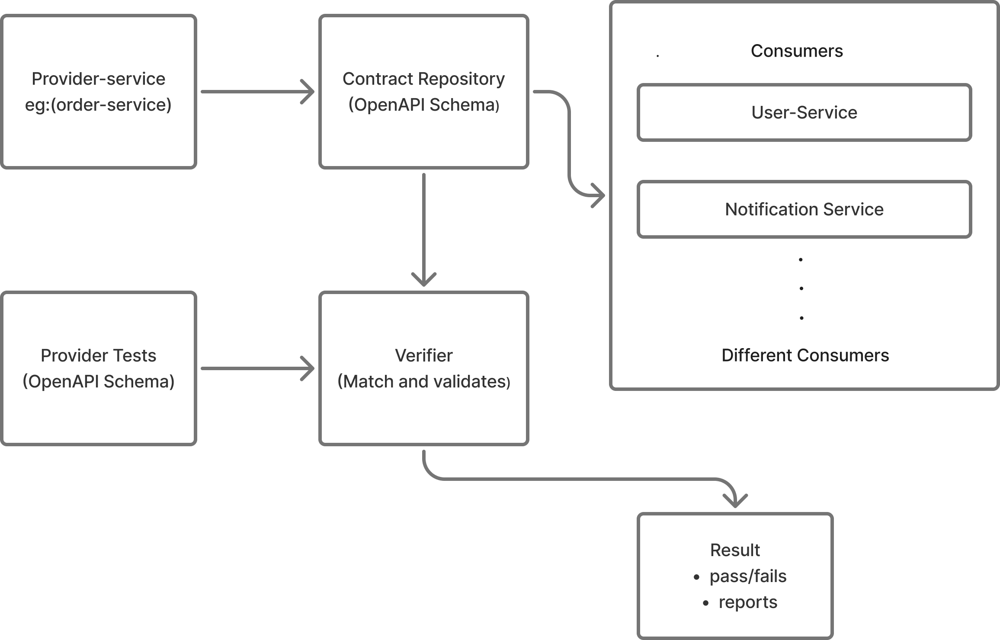
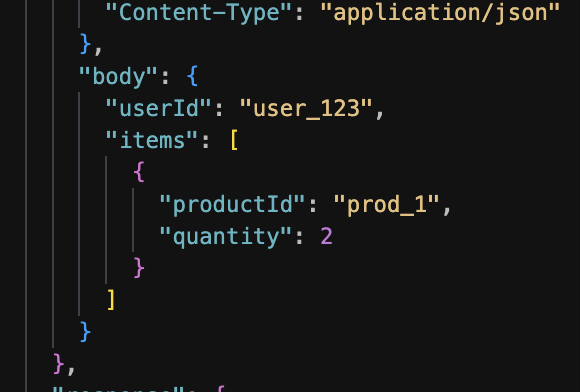
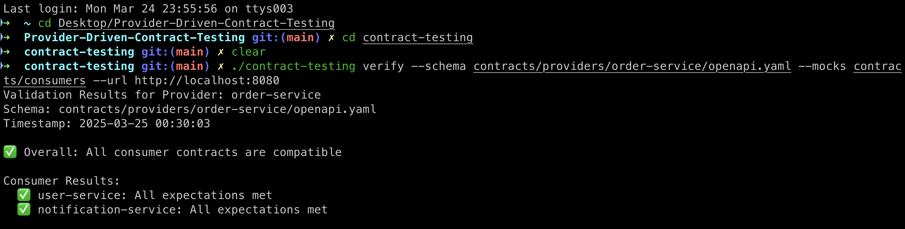
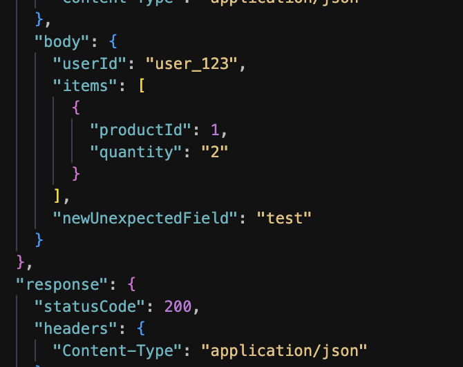
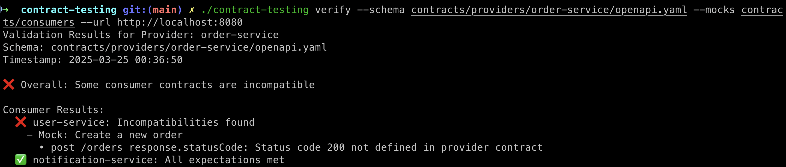

# Architecture of the Provider-Driven-Contract Testing



## File Structure of the project

```
contract-testing/
├── cmd/
│   ├── root.go
│   ├── generate.go
│   ├── verify.go
│   └── report.go
├── internal/
│   ├── schema/
│   │   ├── generator.go
│   │   └── parser.go
│   ├── repository/
│   │   ├── contract_repository.go
│   │   └── mock_repository.go
│   ├── verifier/
│   │   ├── matcher.go
│   │   ├── validator.go
│   │   └── reporter.go
│   └── provider/
│       ├── order_service.go
│       └── endpoints.go
├── contracts/
│   ├── providers/
│   │   └── order-service/
│   │       └── openapi.yaml
│   └── consumers/
│       ├── user-service/
│       │   └── mocks/
│       │       └── create_order.json
│       └── notification-service/
│           └── mocks/
│               └── order_status_update.json
├── main.go
└── go.mod
```

## Explaination of each project

# Contract Testing System: Detailed File Breakdown

## 1\. Provider Schema Generation: `generator.go`

### Overview

The schema generator is responsible for automatically creating comprehensive OpenAPI specifications for services.

### Key Responsibilities

- Automatically analyze service endpoints
- Extract request and response structures
- Generate detailed API contract documentation

### Core Functions

```
// GenerateSchema reflects service structure to create OpenAPI specification
func GenerateSchema(service Service) (*OpenAPISchema, error) {
    // Primary implementation steps:
    // 1. Inspect service endpoints
    // 2. Extract request/response types
    // 3. Create comprehensive OpenAPI specification
}

// SaveSchemaToFile persists generated schema to file system
func SaveSchemaToFile(schema *OpenAPISchema, path string) error {
    // Serialization and file writing logic
}

```

### Implementation Techniques

- Utilizes Go reflection for type analysis
- Supports automatic type inference
- Generates comprehensive endpoint documentation
- Handles complex nested types and validation rules

## 2\. Contract Repository: `contract_repository.go`

### Overview

Central management system for storing and retrieving provider schemas and consumer mocks.

### Key Responsibilities

- Manage contract storage
- Provide centralized contract management
- Enable contract versioning and retrieval

### Core Struct and Methods

```
type ContractRepository struct {
    BasePath string
}

// Save provider schema with standardized path management
func (r *ContractRepository) SaveProviderSchema(providerName string, schema *OpenAPISchema) error {
    // Path generation: contracts/providers/{provider-name}/openapi.yaml
    // Ensures proper directory structure
    // Writes schema file
}

// Retrieve consumer mocks for specific provider
func (r *ContractRepository) GetConsumerMocks(providerName string) ([]ConsumerMock, error) {
    // Scans consumer contracts
    // Filters mocks for specific provider
    // Loads and parses mock files
}

```

### Key Features

- Standardized directory structure
- Multi-provider/consumer support
- Easy schema and mock retrieval
- Built-in versioning support

## 3\. Validation Process: `validator.go`

### Overview

Validates consumer expectations against provider schemas, identifying potential compatibility issues.

### Key Responsibilities

- Load provider schemas
- Validate consumer mocks
- Identify and report compatibility problems

### Core Validation Logic

```
type Validator struct {
    ProviderSchema *OpenAPISchema
    ConsumerMocks  []ConsumerMock
}

// Comprehensive validation of all consumer mocks
func (v *Validator) ValidateAllMocks() *ValidationReport {
    report := &ValidationReport{}

    for _, mock := range v.ConsumerMocks {
        mockResult := v.validateSingleMock(mock)
        report.AddResult(mockResult)
    }

    return report
}

```

### Validation Checks

- Endpoint existence verification
- HTTP method compatibility
- Request/response structure matching
- Data type consistency
- Validation rule adherence

## 4\. Verification Engine: `matcher.go`

### Overview

Performs detailed compatibility comparisons between provider schemas and consumer expectations.

### Key Responsibilities

- Perform detailed contract comparisons
- Identify specific discrepancies
- Classify issues by severity

### Matching Strategy

```
type Matcher struct {
    ProviderSchema *OpenAPISchema
    ConsumerMock   ConsumerMock
}

// Comprehensive compatibility matching
func (m *Matcher) Match() *MatchResult {
    result := &MatchResult{
        Errors:   []MatchError{},
        Warnings: []MatchWarning{},
    }

    m.checkEndpointCompatibility(result)
    m.checkRequestStructures(result)
    m.checkResponseStructures(result)

    return result
}

```

### Matching Capabilities

- Structural comparison
- Type-safe validation
- Severity-based reporting
- Precise compatibility issue identification

## 5\. Reporting System: `reporter.go`

### Overview

Transforms validation results into multiple output formats for comprehensive reporting.

### Key Responsibilities

- Generate reports in various formats
- Create human-readable and machine-processable outputs
- Support multiple reporting methods

### Reporting Methods

```
type Reporter struct {
    ValidationResults *ValidationReport
}

// Generate different report formats
func (r *Reporter) ConsoleReport()      // Terminal output
func (r *Reporter) JSONReport()         // Machine-readable format
func (r *Reporter) HTMLReport()         // Visual inspection
func (r *Reporter) MarkdownReport()     // Documentation-friendly format

```

### Report Features

- Multiple output formats
- Actionable insights
- Visual and programmatic representations

## 6\. CLI Interface: `root.go`

### Overview

Provides a user-friendly command-line interface for interacting with the contract testing system.

### Key Responsibilities

- Parse user commands and flags
- Coordinate system components
- Provide intuitive interaction methods

### CLI Command Structure

```
var rootCmd = &cobra.Command{
    Use:   "contract-test",
    Short: "Provider-driven contract testing system"
}

// Primary CLI commands
var (
    generateCmd = &cobra.Command{
        Use:   "generate",
        Short: "Generate provider schemas"
    }

    verifyCmd = &cobra.Command{
        Use:   "verify",
        Short: "Validate consumer contracts"
    }

    reportCmd = &cobra.Command{
        Use:   "report",
        Short: "Generate validation reports"
    }
)

```

### CLI Capabilities

- `generate`: Schema creation
- `verify`: Contract validation
- `report`: Report generation
- Flexible configuration through flags

## Conclusion

This contract testing system provides a comprehensive, flexible approach to ensuring API compatibility across microservices. By breaking down the process into distinct components, it offers robust validation, reporting, and management of service contracts.

## some working examples

- step 1 : `./contract-testing generate --provider order-service --url http://localhost:8080 --output contracts/providers/order-service/openapi.yaml`
- step 2 : `./contract-testing verify --schema contracts/providers/order-service/openapi.yaml --mocks contracts/consumers --url http://localhost:8080`
- step 3: `./contract-testing report --results validation-results.json --format json --output report.json `
  > explaination

### Output

**If everthing services are compatible and matching**

**expected requests**




**If some contracts which are not compatible**

**different requests from the order-svc**



